.. _collector:

Solar Collector
===============

To capture a lot of heat from the sun, we need a large surface that can absorb
and trap radiant energy. Black objects absorb more radiation than white objects,
so we want it to be black. Air flowing around the object can cool it down, so we
want it to be enclosed in something that prevents air movement. Of course, since
we're trying to heat water, we'll want the enclosed black object to have some
plumbing to allow water to be pumped through it. Put it all together and you
have something like this:

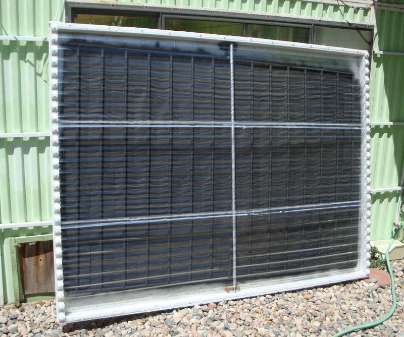

It took about a week to assemble the collector with Dad's help. Let's take a
look at the individual parts. First, there's the box. I made mine using 2x4
lumber and 1/2" plywood. It's 8 feet wide by 6 feet high:

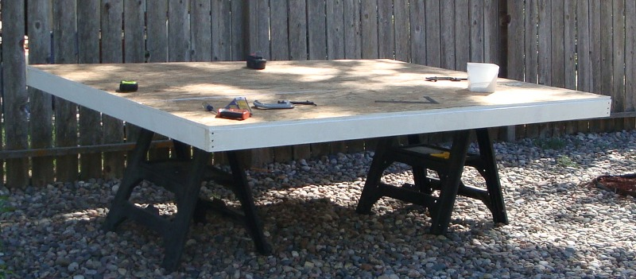

We painted all of the pieces with 1-2-3 primer, and assembled it using a bunch of
miscellaneous 2" screws I had lying around. To ensure an airtight seal, we put a
bead of silicone along all edges to be joined. Inside the box, we put a 1" layer
of foil-backed polyisocyanurate insulation; this should reduce the amount of
heat lost out the back of the collector.

Next up is the plumbing. We used 1/2" copper pipe for all of it; fifteen risers
joining the top and bottom rails, with openings in opposite corners. Cold water
will go in one corner, and warm water will come out the other corner.

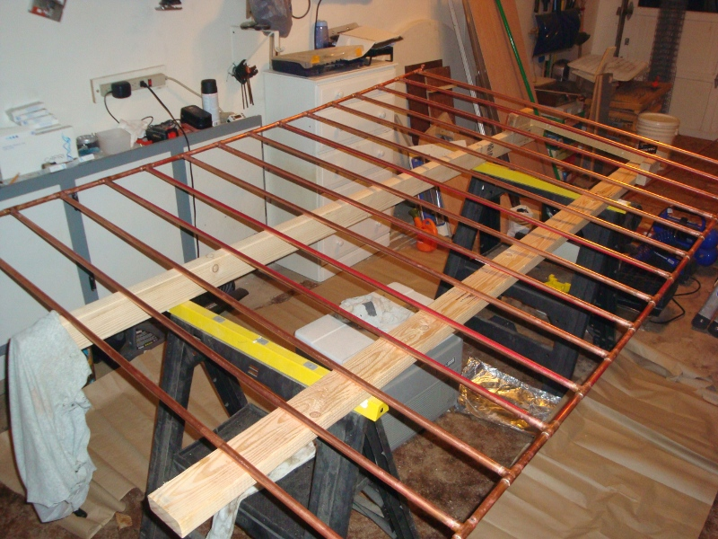

Then we installed the copper grid into the insulated collector box. It's tilted
slightly, which is to allow the water to drain out.

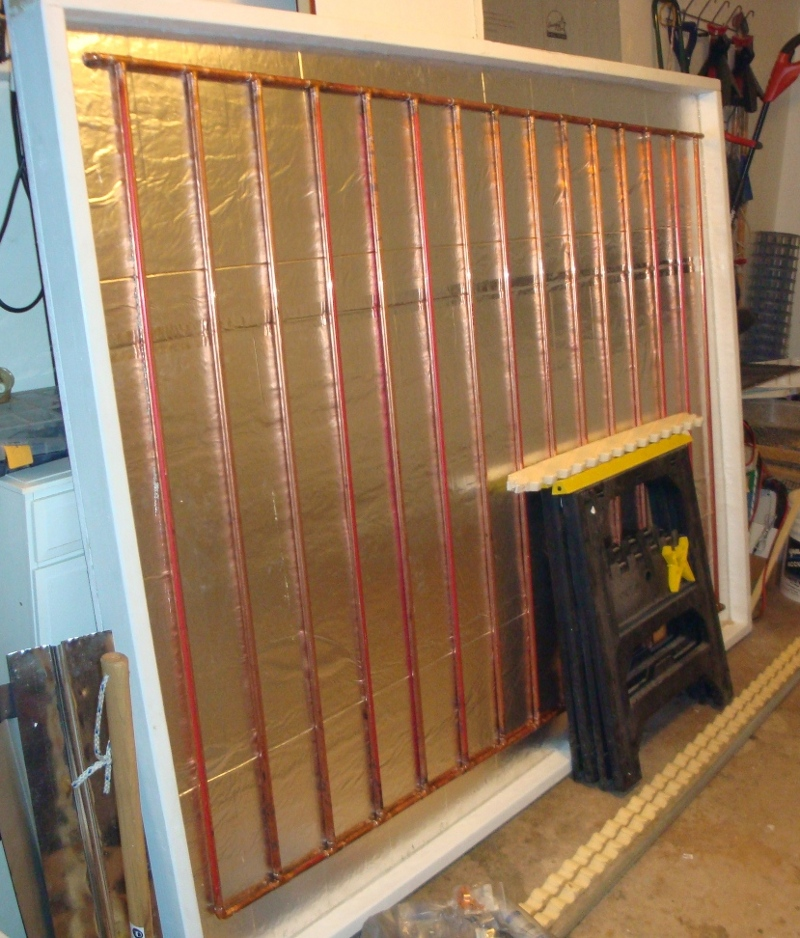

Now, copper is a really good conductor of heat, but with this arrangement, we're
only getting the sunlight that directly hits the copper pipe. The reflective
insulation might help a little, but we want to catch as much direct sunlight as
possible and transfer it to the copper pipes. Most of the designs I've seen use
aluminum fins, wrapped around the copper pipe, to transfer this heat, and I
think it's an excellent idea.

I got several big rolls of aluminum flashing (0.018" thick), and Dad helped me
cut them to short manageable lengths. To accommodate the shape of the pipes, we
used a wooden jig with a horizontal groove, a 3/4" steel rod, and a sledgehammer
to pound them into shape.

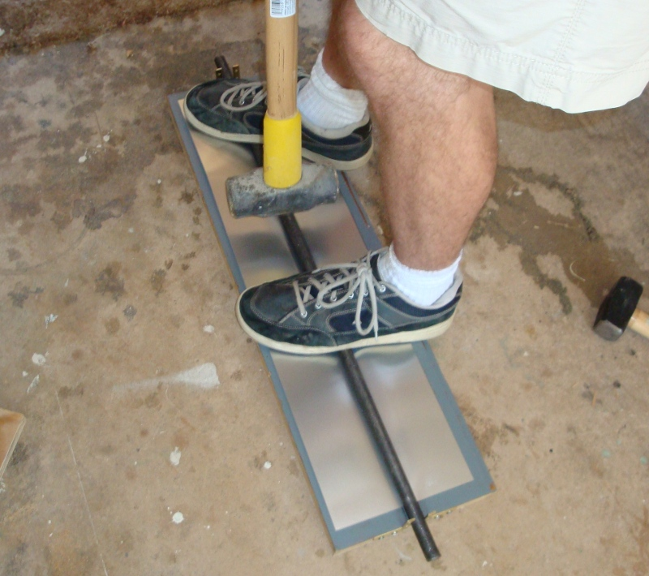

Aluminum flashing is pretty springy, so they don't keep the shape very well, but
it's a pretty good start at having the wrap-around profile I'm looking for. In
order to mitigate possible galvanic corrosion between the aluminum and copper, I
painted the inside grooves black using high-temperature barbecue paint. It
doesn't need to be black, but I was planning to use this paint on the rest of
the fins anyway.

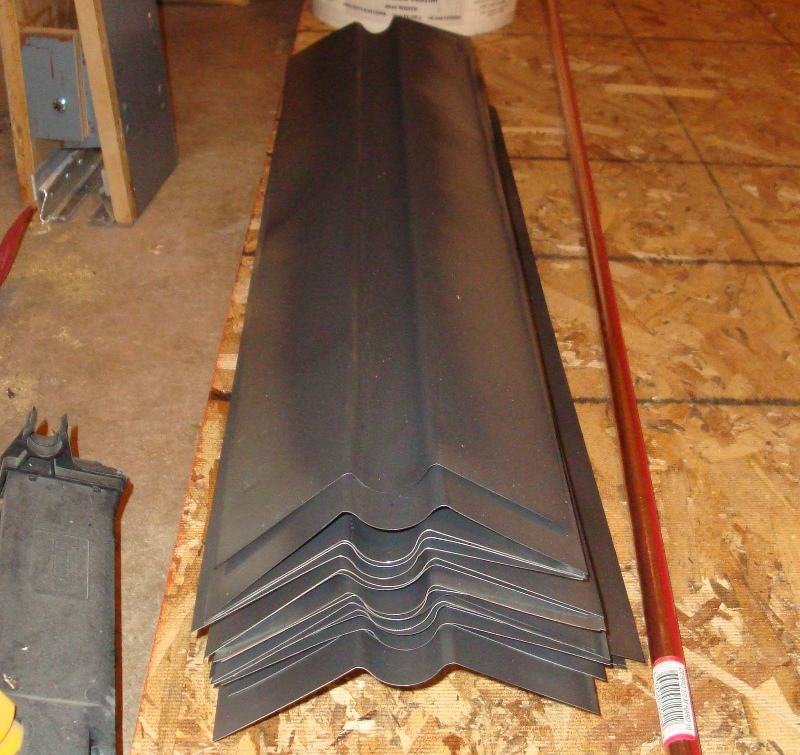

Once that was done, I attached a narrower piece of flashing to the back of each
fin, using self-tapping sheet metal screws down one side only, with silicone in
between for slightly better heat transfer (yeah I know, silicone is not a great
conductor, but as Gary points out, it's a lot more conductive than air, so it's
better than nothing). To attach them to the copper pipe, I can just slide it on
and screw down the other side.

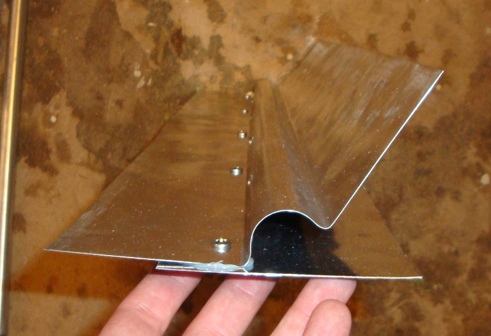

To get the fins clamped on nice and tight, I made another wooden jig with metal
jaws (salvaged from an old screen door) that could pinch the fin under the pipe
and hold it in place while we screwed it down. Again, more silicone to fill in
the air gaps.

Once the fins were all attached, Dad added a few brackets to hold the whole mess
in place:

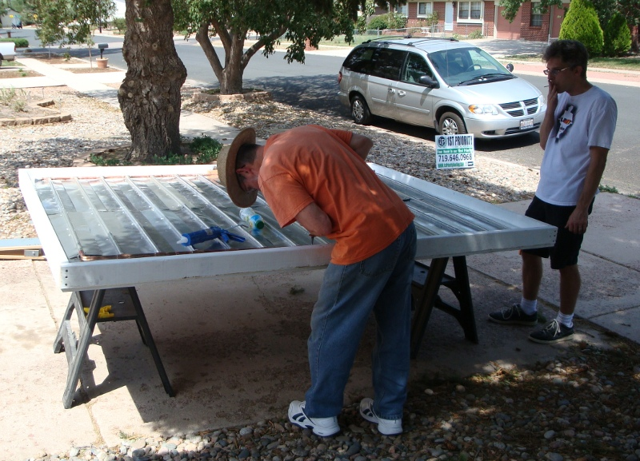

And then some corrugated polycarbonate glazing on the front, attached with short
hex-head screws with rubber gaskets. I drilled the holes in the poly
considerably larger than the screws, since it'll want to expand and contract
(and I don't want it to crack). Of course, liberal use of silicone here too.

After it was all together, I put it out in the sun and stuck a kitchen
thermometer in the copper pipe just to see how hot it was getting. Answer:
Pretty hot.

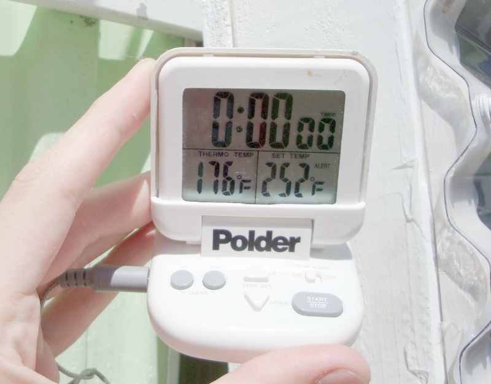

At this point in the narrative, I suppose I should mention the question of where
to put a solar collector. Obviously, it's best to place it somewhere that gets a
lot of sunshine, with relatively few obstacles between the sun and collector. If
I lived in the middle of the plains with no trees on the South side of my house,
it'd be easy, but instead I live in suburban Colorado Springs, where there are
trees, houses, and fences all around, and our house doesn't even face directly
South. Unless I keep track of which parts of the house are sunny at different
times of day throughout the year, I'd have only an indistinct notion of which
area gets the most solar exposure.

Luckily, someone else had already thought of this, and came up with a low-tech
way to do a `solar site survey`_. With a simple printed-out azimuth and
elevation gague, and a handy chart showing the path of the sun throughout the
year at my latitude, it was easy to sketch out the obstacles and find a good
location for the collector. Here's the survey from the location I chose:

.. _solar site survey: http://www.builditsolar.com/SiteSurvey/site_survey.htm

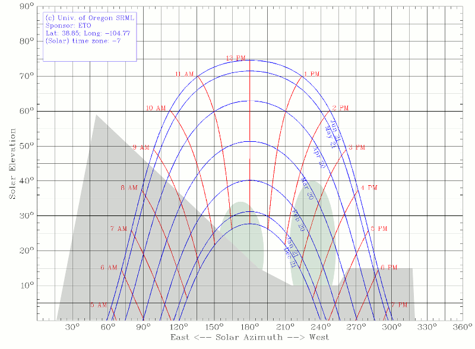

Here, the grey shaded area is the roof of our house (left), as well as the
neighbor's roof and fence. The green shaded areas are two large deciduous trees
which will block sun in the summer, but not so much in the winter. The blue
lines are the path the sun takes, with the topmost one being in June, and the
bottom one being in December. Counting the number of gaps between red lines, we
can see that the summer exposure lasts from about 9am to about 6pm--a good 9
hours of sunshine. Winter isn't so great, having only about 6 hours of sun if
the trees are bare, but still not bad.

The location decided, it's time to mount the thing. Our back porch is a rickety
fiberglass structure, so attaching it to the wall there was out of the question.
Instead, I dug a couple of 3-foot-deep holes, and put in two 10-foot 4x4 posts,
with three 80-pound bags of Quickrete for each post. That oughta hold for a few
years.

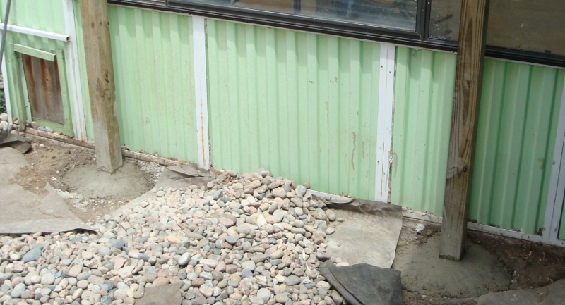

With a friend's help (this thing is heavy!) I attached the collector to the top
of the post using a couple of gate hinges. This allows easy tilt adjustment for
better sun exposure:

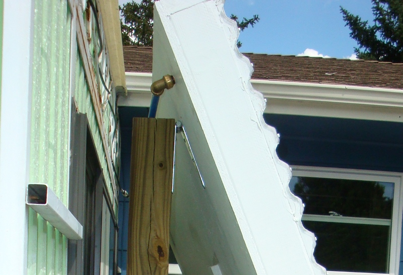

The finished and mounted collector:

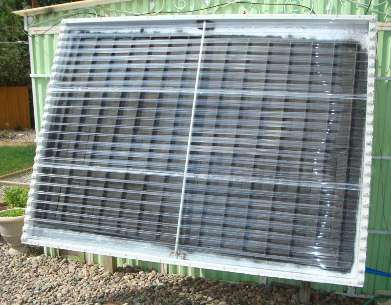

Right! Now we can collect some heat. Where to put it? The :ref:`tank` of course.

