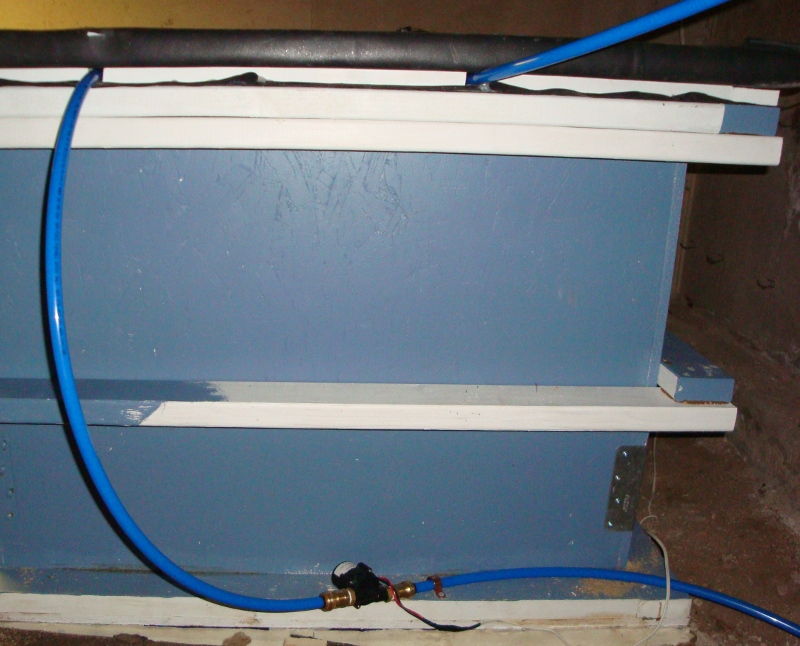
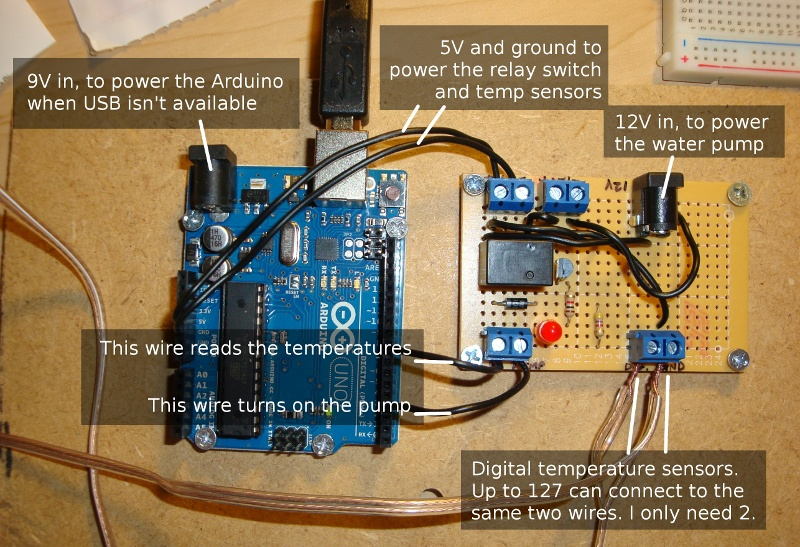
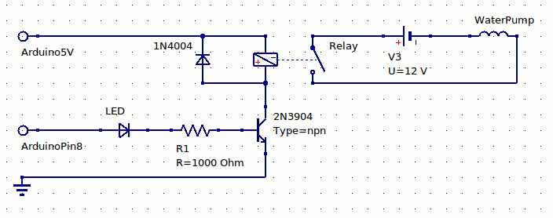
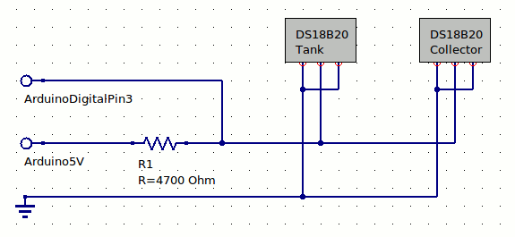

.. _controller:

Pump Controller
===============

Okay, so now that I have something to collect the heat from the sun, and a place
to store the heat, how do I get the heat from one place to another? A pump, of
course. Specifically, a 12 volt DC `Sun-15 pump`_. This seems like a nice little
pump, and it doesn't use much electricity which is a definite plus. It doesn't
have a backflow check valve, which is also a plus in this situation because I
want water to be able to fully drain out of the collector and back into the
tank.

.. _Sun-15 pump: http://sun-pump.com/pumps.htm

The pump's job is to circulate water from the storage tank through the
collector and back into the tank. I had to take some care to make sure the pump
itself was well below the water inlet pipe; I initially tried mounting it about
halfway down the side of the tank, but had some problems with the pump not
staying primed. My initial attempt also had the water inlet pipe sucking water
from the bottom of the tank, but the pump just didn't have enough juice to pull
the water all the way up and over the top edge of the tank that way. Moving the
inlet to the top of the tank, and locating the pump all the way at the bottom
seems to have solved these problems.

The pump didn't come with a mounting bracket, so I just used a C-shaped plumbing
clamp to hold it down on one side:

So you've got a pump, but when should you turn it on? You could put a
thermometer in the collector, and manually switch on the pump when it's sunny.
Or, just run the pump directly from a photovoltaic solar panel--it would
automatically pump whenever the sun is out. I wanted something with a little
more control, and room for optimization. I don't want to run the pump if my
storage tank is already hot enough, and in the winter I expect there will be
times where it's sunny enough to drive the pump, but not sunny enough to heat up
the collector significantly. It's all about temperature.

What's needed, then, is a differential controller--a sort of thermostat that can
turn something on when the difference between two temperatures (in this case,
the collector and tank) is some predetermined amount. You can buy several such
devices off the shelf; the site where I got my pump has `one such model`_. But
I'm a computer programmer by trade; I wanted something I could customize and
extend entirely to my liking.

.. _one such model: http://sun-pump.com/controller.htm

So, I did some Googling, and ended up buying an `Arduino Uno`_, a couple of
`DS18B20 digital temperature sensors`_, and a pile of other components that I
would need for building two circuits:

- Pump relay circuit: Allows controlling the 12V pump from the 5V Ardino
- Sensor circuit: Reads temperature of both sensors from a single pin to the
  Arduino

.. _Arduino Uno: http://arduino.cc/en/Main/ArduinoBoardUno
.. _DS18B20 digital temperature sensors: http://tushev.org/articles/electronics/42-how-it-works-ds18b20-and-arduino

I assembled these circuits on a small prototyping board, and wired it up to the
Arduino, then mounted both of them to a small piece of wood that I can hang on
the wall.

Here are the schematics for the two circuits:

The Arduino can execute whatever code you want, so all I had to do was write up
a short C program with the logic I wanted to use for turning on the pump. This
part is still a work in progress, but here's basically how it works, with the
decision-making going in this order:

- **Collector too cold?** If the collector is cold (below 40F), the pump is
  **off**. This handles the freeze protection; under no circumstances do I want
  to pump water through a freezing (or near freezing) collector. This takes the
  highest priority, since freezing could break my collector.

- **Tank already hot?** If the tank is already hot (above 140F), the pump is
  **off**. This is the safe upper limit I've decided to stick with in order to
  increase the life of the tank liner and PEX plumbing. Again, high priority
  because of the possibility of damaging something.

- **Collector hot enough?** If the collector is over 20F hotter than the tank,
  turn **on** the pump. This is a configurable threshold that is intended to prevent
  the collector temperature from dropping too rapidly when the colder water
  begins circulating. For example, if the tank is 70F and the collector is 90F,
  it makes sense to turn on the pump, but if the tank is 70F and the collector
  is only 80F, there's not much to be gained by turning on the pump yet.

- **Collector not hot enough?** If the collector is less than 10F hotter than
  the tank, turn **off** the pump. I found that with less than 10F of difference,
  the tank might actually lose heat, so this is kind of a "quit while you're
  ahead" threshold. Also, having a different off-threshold helps prevent the
  pump from cycling on and off too much.

- **Otherwise...** If none of these conditions applies, don't change state. This
  only takes effect during the range between the two thresholds. For example, if
  the collector was hot (pump is already on), and is now cooling down, it may be
  11F to 19F warmer than the tank. As long as it stays in this range, the pump
  will stay on, but as soon as the difference drops to 10F, the shut-off
  condition will be reached. It won't turn on again until it hits the 20-degree
  differential.

Because of some glitches with my temperature sensors, I added one more
condition, with the highest priority:

- If either sensor reads below -50F, ignore it.

I'm getting pretty frequent readings of -196.6 degrees from the sensors; it only
happens when the pump relay is on, so I think it has something to do with the 5V
being drawn to hold the relay switch closed, and not enough voltage getting to
the sensors.

I've added my Arduino code, along with circuit diagrams and some other utilities
as a Github project called ardiff_, released under the MIT License, so feel free
to use my code if you build something similar (and let me know how it goes!) I
should mention that I am not any kind of electrical engineer; this was the first
time I've ever soldered any significant circuitry, and I am still learning, so
if you fry your Arduino or pump, don't say I didn't warn you.

.. _ardiff: http://github.com/wapcaplet/ardiff

Does it work? Well, see for yourself at :ref:`results`.

