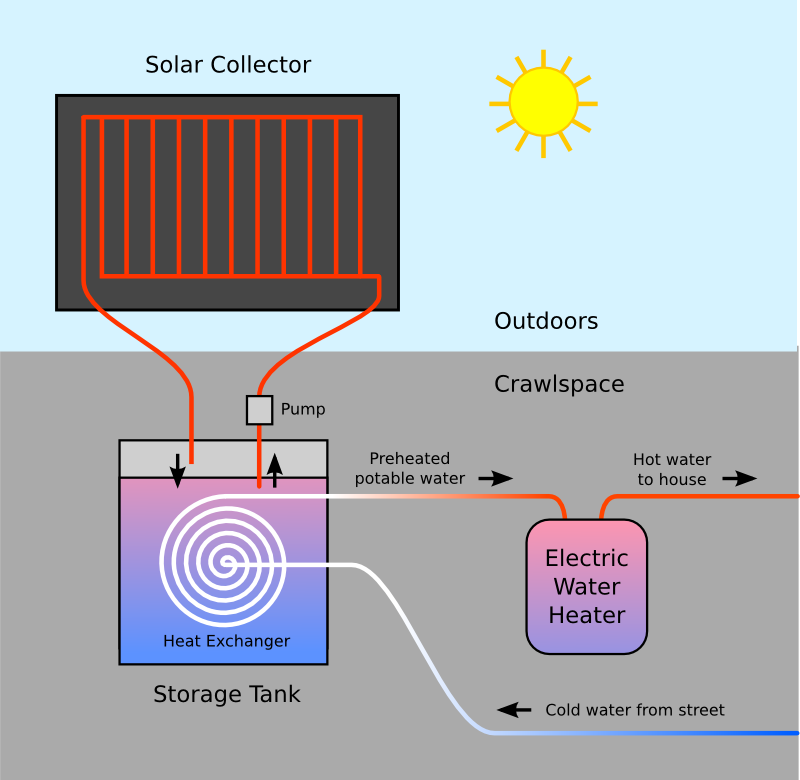

Basic Principles
================

If you've ever left a garden hose out in the sun before turning it on, you know
how easy it is for water to be heated by sunshine. Converting sunlight to
electricity is a fairly complicated process, but converting it to heat is a
no-brainer.

On the other hand, heating water (or anything else) using electricity or natural
gas takes quite a bit of energy (and generates quite a lot of CO2 as a result).
Replacing all this heat energy with the free heat we get from the sun makes a
lot of sense, not only in terms of cost but in its reduced impact on the
environment.

The water heating system I built has two main components:

- Solar Collector: A large surface that is heated by the sun
- Storage Tank: A water tank that stores the accumulated heat

Of course, there's a little more to it than this, but those account for 90% of
the materials and effort. Here's a diagram showing how it all fits together:

