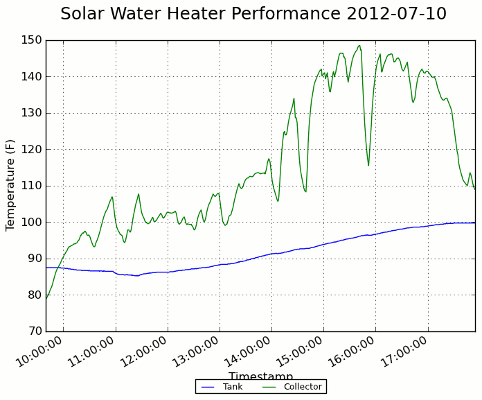

.. _results:

Getting Results
===============

I started seeing some positive results after only a few days of using my new
solar water heater. There were some partly cloudy days, and I had some minor
glitches with the pump, but by logging the tank and collector temperature I
could see it was definitely working.

- **July 4**: The storage tank started the day at 65F, and had climbed up to 80F
  by the evening. 15 degrees doesn't seem like much, but when you consider there
  are 1200 pounds of water to heat up, that equates to about 18,000 BTU, or
  about 5 KWH of electricity.

- **July 5**: The tank temperature was about 79.5F in the morning, so the tank
  didn't lose more than 0.5 degree overnight. It dropped by another 0.5 degree
  to supply water for two showers in the morning. By the end of the day, the
  tank temperature was back up to 96F, meaning we got about 20,000 BTU from the
  sun today.

- **July 6**: Overnight losses plus hot showers dropped the tank temperature to
  about 94F. Mostly cloudy today; the pump turned on for a while, but I
  manually shut it off because the tank was only getting cooler. It was at about
  92F in the early afternoon when I stopped logging. No significant heat gain.

- **July 7**: Tank was about 88F in the morning. Mostly cloudy again today, but
  a couple hours of sun brought it up to 93F by the evening. We'll call it a
  6,000 BTU gain.

- **July 8**: The tank was about 90F after our showers. Only a couple degrees
  rise today.

- **July 9** and **July 10**: Cloudy and rainy; no significant gain.

- **July 10**: Mostly sunny today; tank went from 87F to 99F, about a 14,000 BTU
  gain. Finally got one good spread of logged results, making for a pretty
  graph:

For a breakdown of how much I spent on all this, see :ref:`cost`.

