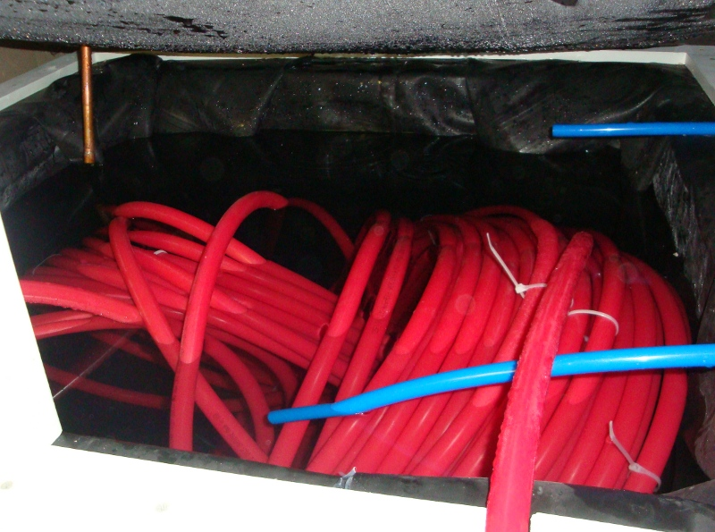
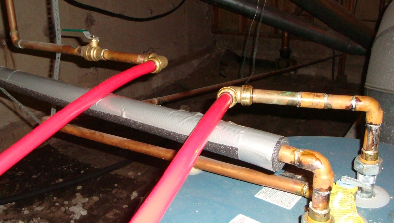
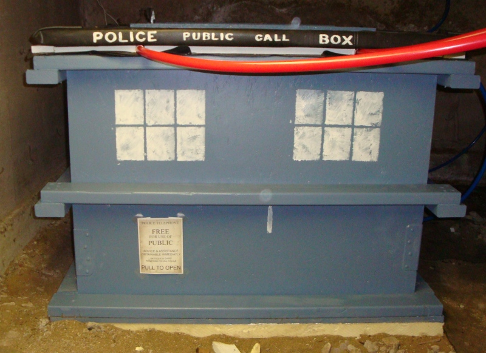

.. _tank:

Storage Tank
============

One way to heat water by solar power is to simply run your cold water supply
through the hot collector. There are some drawbacks to doing it that way,
though:

- No hot water when the sun isn't shining. Without a way to store the heat for
  several hours or days, you'd only be getting hot water when the sun is
  directly heating the collector.
- No freeze protection. In the winter, the collector might get cold enough to
  freeze, which could be disastrous.

A storage tank can solve both of these problems. By accumulating the heated
water in a large insulated tank, you can continue using the hot water even when
it's cold, cloudy, or dark outside. And by using an unpressurized tank, and
unpressurized water supply to the collector, you have the possibility of
draining all the water out of the collector to prevent freezing. This is a
drainback system, and that's what I went with.

The first big decision was how large to make the tank. My collector is 6 x 8 =
48 square feet, and I've read that each square foot of collector can effectively
heat about 2 gallons of water, so I began with a target of about 100 gallons in
mind. Because I had a little extra plywood, I went ahead and increased it to
around 150 gallons, figuring that it's easier to take out some of the water than
to make the tank larger later.

The tank is built from 2x4 lumber and 19/32" plywood sheathing. Inside that is 2
inches of polyiso insulation.

.. image:: images/tank_with_insulation.jpg

I bought a 0.045" thick EPDM pond liner for the inside; it took some creative
folding and arrangement to make it fit in the box without being stretched, but I
made it work. I held it in place with some temporary clamps.

.. image:: images/installing_tank_liner.jpg

It seemed to help to fill up the tank part of the way before the final
attachment of the liner; this made sure that the liner was pressed all the way
down into the corners.

.. image:: images/tank_half_full.jpg

The water that's circulated between the tank and collector is separate from our
potable water supply. You wouldn't want to drink this water; it probably tastes
like rubber anyway. So the heat from the tank needs to be transferred to our
potable water supply via a heat exchanger. There are a few options for how to do
this, but I went with a 300-foot coil of 3/4" PEX tubing:

Pretty early on, I gave up on any hopes of making it all neatly coiled; some
plastic zip ties keep it from getting too unruly, but for the most part I don't
really care if it spills all around the inside of the tank--better thermal
circulation that way anyhow. The blue tubes in this picture are the collector
inlet (bottom) and outlet (top). The inlet obviously needs to remain submerged
so the pump will stay primed; the outlet cannot be submerged, because it needs
to allow air in when the water drains out of the collector.

One end of the heat exchanger is connected to our residential cold water supply,
and the other end is connected directly to the cold-water inlet of our electric
water heater, which becomes our "backup" heater when solar heating is
insufficient.

This should be a no-maintenance arrangement:

- If the storage tank is nice and hot (120F to 140F), the incoming cold water
  should gain sufficient heat just by going through the 300-foot PEX coil. In
  this case, the backup electric water heater won't turn on at all; it'll just
  serve as a secondary storage tank for hot water we're about to use for
  showers, dishes, etc.
- If the storage tank is warm, the incoming cold water at least gains some
  pre-heating before reaching the backup heater, meaning less work for
  the backup heater to do. Say the incoming cold water is 60F, and we want it to
  be 120F: If the solar tank is 90F, that's 50% less energy that the backup
  heater needs to use.
- If the storage tank is cold, meaning either that the collector is
  disconnected, or we've had several cold cloudy days in a row, the cold water
  comes out of the PEX coil still cold, and will be heated up by the
  electric water heater, just as if there was no solar system at all.

I've acquired a thermostatic mixing valve, also known as a tempering valve. It's
not installed yet (it's not clear whether it'll be needed yet), but this will
temper the hot water coming out of the backup heater to prevent dangerously hot
water from reaching our faucet fixtures.

And just for fun, I give you: Thermal Accumulation Reservoir, Done In Style:

Getting the hot water circulated between the tank and collector is just a matter
of hooking up a water pump. Deciding when to turn on the pump is a somewhat
hairier question, though. For that, I need a :ref:`controller`.

