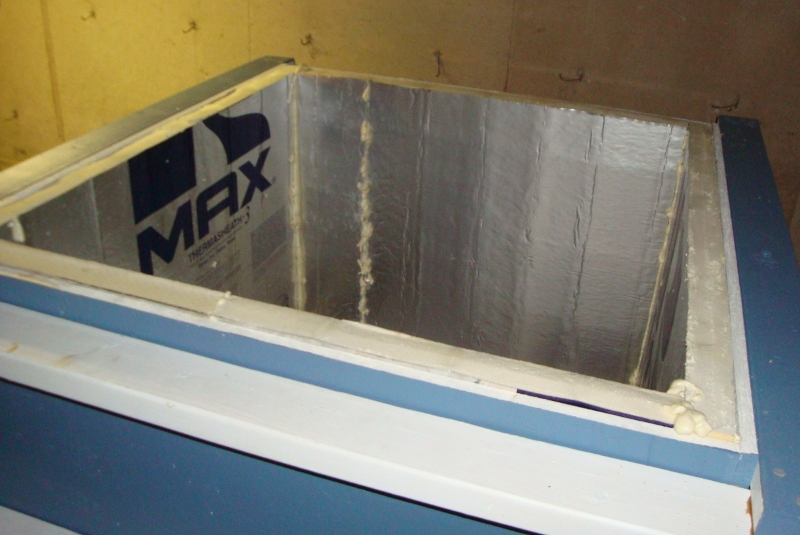
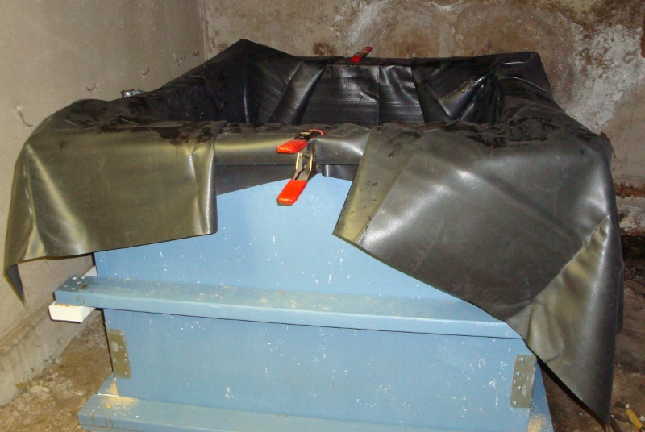
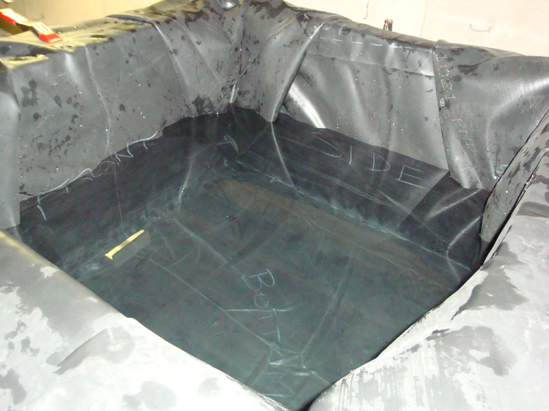

Storage Tank
============

One way to heat water by solar power is to simply run your cold water supply
through the hot collector. There are some drawbacks to doing it that way,
though:

- No hot water when the sun isn't shining. Without a way to store the heat for
  several hours or days, you'd only be getting hot water when the sun is
  directly heating the collector.
- No freeze protection. In the winter, the collector might get cold enough to
  freeze, which could be disastrous.

A storage tank can solve both of these problems. By accumulating the heated
water in a large insulated tank, you can continue using the hot water even when
it's cold, cloudy, or dark outside. And by using an unpressurized tank, and
unpressurized water supply to the collector, you have the possibility of
draining all the water out of the collector to prevent freezing. This is a
drainback system, and that's what I went with.

The first big decision was how large to make the tank. My collector is 6 x 8 =
48 square feet, and I've read that each square foot of collector can effectively
heat about 2 gallons of water, so I began with a target of about 100 gallons in
mind. Because I had a little extra plywood, I went ahead and increased it to
around 150 gallons, figuring that it's easier to take out some of the water than
to make the tank larger later.

The tank is built from 2x4 lumber and 3/4" plywood. Inside that is 2 inches of
polyiso insulation.

I bought a 0.045" thick EPDM pond liner for the inside; it took some creative
folding and arrangement to make it fit in the box without being stretched, but I
made it work. I held it in place with some temporary clamps.

It seemed to help to fill up the tank part of the way before the final
attachment of the liner; this made sure that the liner was pressed all the way
down into the corners.

